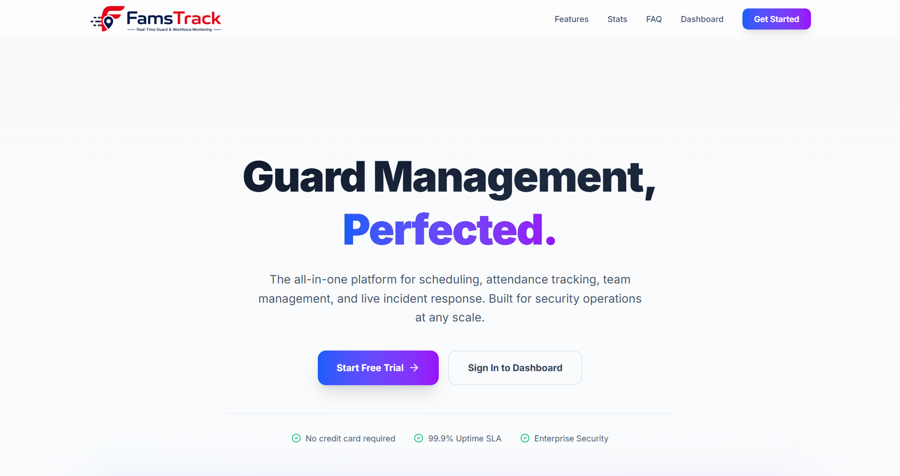

# Hi there, I'm Malik Md Apu Rahman! 👋

### [Founder](https://www.anzdevelopers.com/team/mmar58) of [AnZDevelopers](https://www.anzdevelopers.com) 🚀
*Building things to make people's life fun, easy, and more productive.*

---

## 🛠️ Tech Stack

### 🎮 Game & App Development

### 💻 Web Development

---

## 💼 Work Experience

### 🚀 AnzDevelopers
**Founder & Lead Developer**  
*Dec 14, 2025 - Present*  
- Leading the development of fun and productive tools.
- One-man army handling everything from game logic (Unity) to real-time web backends (Node.js).

### 🪄 Magic Mind
**Lead Unity and Web Developer**  
*Sep 2022 - Present*  
- **Lead Unity and Web Developer** _(Current)_  
  Leading the development team for Unity games and web applications.
- **Unity Developer**  _(Sep 2023 - Jan 2025)_  
  Developed and maintained core gameplay mechanics.
- **Junior Unity Developer** _(Sep 2022 - Sep 2023)_  
  Started journey in game development, learning and shipping features.

---

## � Current Working Projects

<!-- ### [Project Name 1]
*Brief description of what you are building right now.*
- **Tech Stack**: Unity, C# / Svelte, Node.js
- [� GitHub](#) • [🌐 Live Demo](#) -->

---

## 📂 Portfolio

### [Famstrack](https://www.famstrack.com)
*A comprehensive workforce and security management system featuring a real-time web dashboard, backend API, and a mobile app for field employees.*

**✨ Key Features:**
- **Multi-Tenant Architecture:** Designed for SaaS with company isolation, feature toggling, and role-based access control (Admin, Manager, Guard).
- **Offline-First Mobile App:** Field workers can complete shift tours, capture checkpoints, and take photo evidence without internet access; automatically syncs when back online.
- **Real-Time Tracking & Dashboard:** Live map tracking, instant incident reports, and real-time attendance (clock-ins/clock-outs) powered by Socket.IO.
- **Shift & Tour Management:** Comprehensive shift scheduling, checkpoint tours, and automated shift assignments.

- **Tech Stack**: SvelteKit, Node.js, Fastify, Socket.IO, MySQL, Redis, Flutter, Dart
- [🌐 Live Site](https://www.famstrack.com)

<!-- ### [Awesome Game Title]
*A fun and addictive 2D platformer game.*
- **Tech Stack**: Unity, C#
- [💻 GitHub](#) • [🌐 Play Store/App Store](#)

### [Productivity Web App]
*A real-time task management tool.*
- **Tech Stack**: Svelte, Node.js, Socket.io
- [💻 GitHub](#) • [🌐 Live Site](#) -->

---

## 📫 Connect with Me

- 📧 **Email**: [rahmanapu118@gmail.com](mailto:rahmanapu118@gmail.com)
- 📞 **Contact us**: [Contact us](https://www.anzdevelopers.com/contact)
- 💼 **Upwork**: [Hire me on Upwork](https://www.upwork.com/freelancers/~01592faa28412cc5a0)
- 💼 **Fiverr**: [Hire me on Fiverr](https://www.fiverr.com/mmar58)
